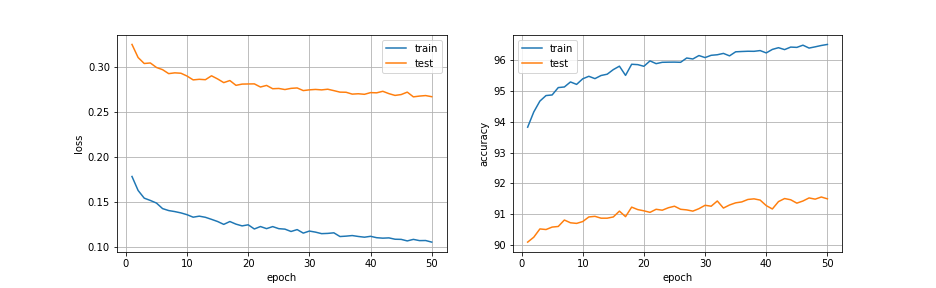

# Адаптивный тензорный алгоритм поиска размера фильтров свёрточных слоев нейросетей.

## Pipeline (см. Pipeline.ipynb):
### 0. Validate pretrained
Берём предобученную ResNet32 (``pretrained_models/resnet32-d509ac18.th``). Посмотрим на accuracy у исходной модели.
```
%run stage_0/validate_pretrained.py

Test: [0/79]	Time 9.200 (9.200)	Loss 0.2115 (0.2115)	Prec@1 93.750 (93.750)
Test: [50/79]	Time 0.332 (0.538)	Loss 0.4470 (0.3828)	Prec@1 90.625 (92.371)
 * Prec@1 92.630
 * Timec@1 0.493
```

### 1. Get initial weights
Берём предобученную ResNet32 (``pretrained_models/resnet32-d509ac18.th``). Вытаскиваем веса, кладём тензоры в ``weights/weigths_base.mat``.
```
%run stage_1/get_initial_weights.py
```
Затем расскладываем веса в CP-decomposition, использую NLS (non-linear least squares), с помощью ``cpd_nls`` из [Tensorlab](https://www.tensorlab.net) в MATLAB (примерный скрипт в ``MATLAB/script_matlab_decompose.m``). В файле ``weights/weights_nls.mat``

### 2. Fine-tune initial decomposition
Заменяем набор слоёв в моделе на декомпозированные (все фильтры 3x3) (``weigths/weigths_nls.mat``) с помощью ``cpd_nls``. Затем делаем файнтюнинг весов (``epochs=50``). Лучшая модель сохранена в ``decomposed/best_initial_decompose.th``. Заменённые слои можно посмотреть в ``functional.py``, в примере их 6.
```
%run stage_2/fine_tune_initial_decomposition.py

...
Test: [0/79]	Time 7.342 (7.342)	Loss 0.3062 (0.3062)	Prec@1 92.969 (92.969)
Test: [50/79]	Time 0.303 (0.508)	Loss 0.5858 (0.4408)	Prec@1 90.625 (91.330)
 * Prec@1 91.520
 * Timec@1 0.430
```


Можно запустить ``stage_2/check.py``, чтобы посмотреть на структуру модели и accuracy на тестовой выборке y ``decompose/best_initial_decompose.th`` (это быстро). Хуже на 1.1 от исходной модели.
<details>
   <summary><b>%run stage_2/check.py</b></summary>
   <pre>
DataParallel(
  (module): ResNet(
    (conv1): Conv2d(3, 16, kernel_size=(3, 3), stride=(1, 1), padding=(1, 1), bias=False)
    (bn1): BatchNorm2d(16, eps=1e-05, momentum=0.1, affine=True, track_running_stats=True)
    (layer1): Sequential(
      (0): BasicBlock(
        (conv1): Conv2d(16, 16, kernel_size=(3, 3), stride=(1, 1), padding=(1, 1), bias=False)
        (bn1): BatchNorm2d(16, eps=1e-05, momentum=0.1, affine=True, track_running_stats=True)
        (conv2): Conv2d(16, 16, kernel_size=(3, 3), stride=(1, 1), padding=(1, 1), bias=False)
        (bn2): BatchNorm2d(16, eps=1e-05, momentum=0.1, affine=True, track_running_stats=True)
        (shortcut): Sequential()
      )
      (1): BasicBlock(
        (conv1): Conv2d(16, 16, kernel_size=(3, 3), stride=(1, 1), padding=(1, 1), bias=False)
        (bn1): BatchNorm2d(16, eps=1e-05, momentum=0.1, affine=True, track_running_stats=True)
        (conv2): Sequential(
          (0_decomposed): Conv2d(16, 8, kernel_size=(1, 1), stride=(1, 1), bias=False)
          (1_decomposed): Conv2d(8, 8, kernel_size=(3, 1), stride=(1, 1), padding=(1, 0), groups=8, bias=False)
          (2_decomposed): Conv2d(8, 8, kernel_size=(1, 3), stride=(1, 1), padding=(0, 1), groups=8, bias=False)
          (3_decomposed): Conv2d(8, 16, kernel_size=(1, 1), stride=(1, 1), bias=False)
        )
        (bn2): BatchNorm2d(16, eps=1e-05, momentum=0.1, affine=True, track_running_stats=True)
        (shortcut): Sequential()
      )
      (2): BasicBlock(
        (conv1): Conv2d(16, 16, kernel_size=(3, 3), stride=(1, 1), padding=(1, 1), bias=False)
        (bn1): BatchNorm2d(16, eps=1e-05, momentum=0.1, affine=True, track_running_stats=True)
        (conv2): Conv2d(16, 16, kernel_size=(3, 3), stride=(1, 1), padding=(1, 1), bias=False)
        (bn2): BatchNorm2d(16, eps=1e-05, momentum=0.1, affine=True, track_running_stats=True)
        (shortcut): Sequential()
      )
      (3): BasicBlock(
        (conv1): Conv2d(16, 16, kernel_size=(3, 3), stride=(1, 1), padding=(1, 1), bias=False)
        (bn1): BatchNorm2d(16, eps=1e-05, momentum=0.1, affine=True, track_running_stats=True)
        (conv2): Sequential(
          (0_decomposed): Conv2d(16, 8, kernel_size=(1, 1), stride=(1, 1), bias=False)
          (1_decomposed): Conv2d(8, 8, kernel_size=(3, 1), stride=(1, 1), padding=(1, 0), groups=8, bias=False)
          (2_decomposed): Conv2d(8, 8, kernel_size=(1, 3), stride=(1, 1), padding=(0, 1), groups=8, bias=False)
          (3_decomposed): Conv2d(8, 16, kernel_size=(1, 1), stride=(1, 1), bias=False)
        )
        (bn2): BatchNorm2d(16, eps=1e-05, momentum=0.1, affine=True, track_running_stats=True)
        (shortcut): Sequential()
      )
      (4): BasicBlock(
        (conv1): Conv2d(16, 16, kernel_size=(3, 3), stride=(1, 1), padding=(1, 1), bias=False)
        (bn1): BatchNorm2d(16, eps=1e-05, momentum=0.1, affine=True, track_running_stats=True)
        (conv2): Conv2d(16, 16, kernel_size=(3, 3), stride=(1, 1), padding=(1, 1), bias=False)
        (bn2): BatchNorm2d(16, eps=1e-05, momentum=0.1, affine=True, track_running_stats=True)
        (shortcut): Sequential()
      )
    )
    (layer2): Sequential(
      (0): BasicBlock(
        (conv1): Conv2d(16, 32, kernel_size=(3, 3), stride=(2, 2), padding=(1, 1), bias=False)
        (bn1): BatchNorm2d(32, eps=1e-05, momentum=0.1, affine=True, track_running_stats=True)
        (conv2): Conv2d(32, 32, kernel_size=(3, 3), stride=(1, 1), padding=(1, 1), bias=False)
        (bn2): BatchNorm2d(32, eps=1e-05, momentum=0.1, affine=True, track_running_stats=True)
        (shortcut): LambdaLayer()
      )
      (1): BasicBlock(
        (conv1): Conv2d(32, 32, kernel_size=(3, 3), stride=(1, 1), padding=(1, 1), bias=False)
        (bn1): BatchNorm2d(32, eps=1e-05, momentum=0.1, affine=True, track_running_stats=True)
        (conv2): Sequential(
          (0_decomposed): Conv2d(32, 16, kernel_size=(1, 1), stride=(1, 1), bias=False)
          (1_decomposed): Conv2d(16, 16, kernel_size=(3, 1), stride=(1, 1), padding=(1, 0), groups=16, bias=False)
          (2_decomposed): Conv2d(16, 16, kernel_size=(1, 3), stride=(1, 1), padding=(0, 1), groups=16, bias=False)
          (3_decomposed): Conv2d(16, 32, kernel_size=(1, 1), stride=(1, 1), bias=False)
        )
        (bn2): BatchNorm2d(32, eps=1e-05, momentum=0.1, affine=True, track_running_stats=True)
        (shortcut): Sequential()
      )
      (2): BasicBlock(
        (conv1): Conv2d(32, 32, kernel_size=(3, 3), stride=(1, 1), padding=(1, 1), bias=False)
        (bn1): BatchNorm2d(32, eps=1e-05, momentum=0.1, affine=True, track_running_stats=True)
        (conv2): Conv2d(32, 32, kernel_size=(3, 3), stride=(1, 1), padding=(1, 1), bias=False)
        (bn2): BatchNorm2d(32, eps=1e-05, momentum=0.1, affine=True, track_running_stats=True)
        (shortcut): Sequential()
      )
      (3): BasicBlock(
        (conv1): Conv2d(32, 32, kernel_size=(3, 3), stride=(1, 1), padding=(1, 1), bias=False)
        (bn1): BatchNorm2d(32, eps=1e-05, momentum=0.1, affine=True, track_running_stats=True)
        (conv2): Sequential(
          (0_decomposed): Conv2d(32, 16, kernel_size=(1, 1), stride=(1, 1), bias=False)
          (1_decomposed): Conv2d(16, 16, kernel_size=(3, 1), stride=(1, 1), padding=(1, 0), groups=16, bias=False)
          (2_decomposed): Conv2d(16, 16, kernel_size=(1, 3), stride=(1, 1), padding=(0, 1), groups=16, bias=False)
          (3_decomposed): Conv2d(16, 32, kernel_size=(1, 1), stride=(1, 1), bias=False)
        )
        (bn2): BatchNorm2d(32, eps=1e-05, momentum=0.1, affine=True, track_running_stats=True)
        (shortcut): Sequential()
      )
      (4): BasicBlock(
        (conv1): Conv2d(32, 32, kernel_size=(3, 3), stride=(1, 1), padding=(1, 1), bias=False)
        (bn1): BatchNorm2d(32, eps=1e-05, momentum=0.1, affine=True, track_running_stats=True)
        (conv2): Conv2d(32, 32, kernel_size=(3, 3), stride=(1, 1), padding=(1, 1), bias=False)
        (bn2): BatchNorm2d(32, eps=1e-05, momentum=0.1, affine=True, track_running_stats=True)
        (shortcut): Sequential()
      )
    )
    (layer3): Sequential(
      (0): BasicBlock(
        (conv1): Conv2d(32, 64, kernel_size=(3, 3), stride=(2, 2), padding=(1, 1), bias=False)
        (bn1): BatchNorm2d(64, eps=1e-05, momentum=0.1, affine=True, track_running_stats=True)
        (conv2): Conv2d(64, 64, kernel_size=(3, 3), stride=(1, 1), padding=(1, 1), bias=False)
        (bn2): BatchNorm2d(64, eps=1e-05, momentum=0.1, affine=True, track_running_stats=True)
        (shortcut): LambdaLayer()
      )
      (1): BasicBlock(
        (conv1): Conv2d(64, 64, kernel_size=(3, 3), stride=(1, 1), padding=(1, 1), bias=False)
        (bn1): BatchNorm2d(64, eps=1e-05, momentum=0.1, affine=True, track_running_stats=True)
        (conv2): Sequential(
          (0_decomposed): Conv2d(64, 32, kernel_size=(1, 1), stride=(1, 1), bias=False)
          (1_decomposed): Conv2d(32, 32, kernel_size=(3, 1), stride=(1, 1), padding=(1, 0), groups=32, bias=False)
          (2_decomposed): Conv2d(32, 32, kernel_size=(1, 3), stride=(1, 1), padding=(0, 1), groups=32, bias=False)
          (3_decomposed): Conv2d(32, 64, kernel_size=(1, 1), stride=(1, 1), bias=False)
        )
        (bn2): BatchNorm2d(64, eps=1e-05, momentum=0.1, affine=True, track_running_stats=True)
        (shortcut): Sequential()
      )
      (2): BasicBlock(
        (conv1): Conv2d(64, 64, kernel_size=(3, 3), stride=(1, 1), padding=(1, 1), bias=False)
        (bn1): BatchNorm2d(64, eps=1e-05, momentum=0.1, affine=True, track_running_stats=True)
        (conv2): Conv2d(64, 64, kernel_size=(3, 3), stride=(1, 1), padding=(1, 1), bias=False)
        (bn2): BatchNorm2d(64, eps=1e-05, momentum=0.1, affine=True, track_running_stats=True)
        (shortcut): Sequential()
      )
      (3): BasicBlock(
        (conv1): Conv2d(64, 64, kernel_size=(3, 3), stride=(1, 1), padding=(1, 1), bias=False)
        (bn1): BatchNorm2d(64, eps=1e-05, momentum=0.1, affine=True, track_running_stats=True)
        (conv2): Sequential(
          (0_decomposed): Conv2d(64, 32, kernel_size=(1, 1), stride=(1, 1), bias=False)
          (1_decomposed): Conv2d(32, 32, kernel_size=(3, 1), stride=(1, 1), padding=(1, 0), groups=32, bias=False)
          (2_decomposed): Conv2d(32, 32, kernel_size=(1, 3), stride=(1, 1), padding=(0, 1), groups=32, bias=False)
          (3_decomposed): Conv2d(32, 64, kernel_size=(1, 1), stride=(1, 1), bias=False)
        )
        (bn2): BatchNorm2d(64, eps=1e-05, momentum=0.1, affine=True, track_running_stats=True)
        (shortcut): Sequential()
      )
      (4): BasicBlock(
        (conv1): Conv2d(64, 64, kernel_size=(3, 3), stride=(1, 1), padding=(1, 1), bias=False)
        (bn1): BatchNorm2d(64, eps=1e-05, momentum=0.1, affine=True, track_running_stats=True)
        (conv2): Conv2d(64, 64, kernel_size=(3, 3), stride=(1, 1), padding=(1, 1), bias=False)
        (bn2): BatchNorm2d(64, eps=1e-05, momentum=0.1, affine=True, track_running_stats=True)
        (shortcut): Sequential()
      )
    )
    (linear): Linear(in_features=64, out_features=10, bias=True)
  )
)
Files already downloaded and verified
Test: [0/79]	Time 7.342 (7.342)	Loss 0.3062 (0.3062)	Prec@1 92.969 (92.969)
Test: [50/79]	Time 0.303 (0.508)	Loss 0.5858 (0.4408)	Prec@1 90.625 (91.330)
 * Prec@1 91.520
 * Timec@1 0.430
   </pre>
</details>

### 3. Extend Decomposed Kernels
Берём отфайнтьюниную модель с предыдущего шага (``decomposed/best_initital_decompose.th``). Увеличиваем факторы (``1_decomposed``, ``2_decomposed``) до размеров 1x21 и 21x1. Добавляем сигмы ``resnet_with_sigmas.py`` и обучаем вместе с сигмами. Модель с лучшим приближением сохранена в ``decompose/best_extended_decompose.th``.

```
%run stage_3/extend_decomposed_kernels.py
```


Можно запустить ``stage_3/check.py``, чтобы посмотреть на структуру модели, значения сигм, соответствующие им размеры ядер и и accuracy на тестовой выборке y ``decompose/best_extended_decompose.th`` (это быстро). 
```
%run stage_3/check.py

...
best sigmas:  [-1.0235847234725952, -1.6244574785232544, -0.6324220895767212, -1.0306727886199951, -0.5999158024787903, -0.45050451159477234]
best kernels_sz:  [9, 7, 11, 9, 11, 11]
Files already downloaded and verified
Test: [0/79]	Time 7.086 (7.086)	Loss 0.2054 (0.2054)	Prec@1 91.406 (91.406)
Test: [50/79]	Time 0.432 (0.575)	Loss 0.4664 (0.3881)	Prec@1 85.938 (88.817)
 * Prec@1 89.050
 * Timec@1 0.520
```
<details>
   <summary><b>%run stage_3/check.py</b></summary>
   <pre>
         DataParallel(
  (module): ResNet(
    (conv1): Conv2d(3, 16, kernel_size=(3, 3), stride=(1, 1), padding=(1, 1), bias=False)
    (bn1): BatchNorm2d(16, eps=1e-05, momentum=0.1, affine=True, track_running_stats=True)
    (layer1): Sequential(
      (0): BasicBlock(
        (conv1): Conv2d(16, 16, kernel_size=(3, 3), stride=(1, 1), padding=(1, 1), bias=False)
        (bn1): BatchNorm2d(16, eps=1e-05, momentum=0.1, affine=True, track_running_stats=True)
        (conv2): Conv2d(16, 16, kernel_size=(3, 3), stride=(1, 1), padding=(1, 1), bias=False)
        (bn2): BatchNorm2d(16, eps=1e-05, momentum=0.1, affine=True, track_running_stats=True)
        (shortcut): Sequential()
      )
      (1): BasicBlock(
        (conv1): Conv2d(16, 16, kernel_size=(3, 3), stride=(1, 1), padding=(1, 1), bias=False)
        (bn1): BatchNorm2d(16, eps=1e-05, momentum=0.1, affine=True, track_running_stats=True)
        (conv2): Sequential(
          (0_decomposed): Conv2d(16, 8, kernel_size=(1, 1), stride=(1, 1), bias=False)
          (1_decomposed): Conv2d(8, 8, kernel_size=(21, 1), stride=(1, 1), padding=(10, 0), groups=8, bias=False)
          (2_decomposed): Conv2d(8, 8, kernel_size=(1, 21), stride=(1, 1), padding=(0, 10), groups=8, bias=False)
          (3_decomposed): Conv2d(8, 16, kernel_size=(1, 1), stride=(1, 1), bias=False)
        )
        (bn2): BatchNorm2d(16, eps=1e-05, momentum=0.1, affine=True, track_running_stats=True)
        (shortcut): Sequential()
      )
      (2): BasicBlock(
        (conv1): Conv2d(16, 16, kernel_size=(3, 3), stride=(1, 1), padding=(1, 1), bias=False)
        (bn1): BatchNorm2d(16, eps=1e-05, momentum=0.1, affine=True, track_running_stats=True)
        (conv2): Conv2d(16, 16, kernel_size=(3, 3), stride=(1, 1), padding=(1, 1), bias=False)
        (bn2): BatchNorm2d(16, eps=1e-05, momentum=0.1, affine=True, track_running_stats=True)
        (shortcut): Sequential()
      )
      (3): BasicBlock(
        (conv1): Conv2d(16, 16, kernel_size=(3, 3), stride=(1, 1), padding=(1, 1), bias=False)
        (bn1): BatchNorm2d(16, eps=1e-05, momentum=0.1, affine=True, track_running_stats=True)
        (conv2): Sequential(
          (0_decomposed): Conv2d(16, 8, kernel_size=(1, 1), stride=(1, 1), bias=False)
          (1_decomposed): Conv2d(8, 8, kernel_size=(21, 1), stride=(1, 1), padding=(10, 0), groups=8, bias=False)
          (2_decomposed): Conv2d(8, 8, kernel_size=(1, 21), stride=(1, 1), padding=(0, 10), groups=8, bias=False)
          (3_decomposed): Conv2d(8, 16, kernel_size=(1, 1), stride=(1, 1), bias=False)
        )
        (bn2): BatchNorm2d(16, eps=1e-05, momentum=0.1, affine=True, track_running_stats=True)
        (shortcut): Sequential()
      )
      (4): BasicBlock(
        (conv1): Conv2d(16, 16, kernel_size=(3, 3), stride=(1, 1), padding=(1, 1), bias=False)
        (bn1): BatchNorm2d(16, eps=1e-05, momentum=0.1, affine=True, track_running_stats=True)
        (conv2): Conv2d(16, 16, kernel_size=(3, 3), stride=(1, 1), padding=(1, 1), bias=False)
        (bn2): BatchNorm2d(16, eps=1e-05, momentum=0.1, affine=True, track_running_stats=True)
        (shortcut): Sequential()
      )
    )
    (layer2): Sequential(
      (0): BasicBlock(
        (conv1): Conv2d(16, 32, kernel_size=(3, 3), stride=(2, 2), padding=(1, 1), bias=False)
        (bn1): BatchNorm2d(32, eps=1e-05, momentum=0.1, affine=True, track_running_stats=True)
        (conv2): Conv2d(32, 32, kernel_size=(3, 3), stride=(1, 1), padding=(1, 1), bias=False)
        (bn2): BatchNorm2d(32, eps=1e-05, momentum=0.1, affine=True, track_running_stats=True)
        (shortcut): LambdaLayer()
      )
      (1): BasicBlock(
        (conv1): Conv2d(32, 32, kernel_size=(3, 3), stride=(1, 1), padding=(1, 1), bias=False)
        (bn1): BatchNorm2d(32, eps=1e-05, momentum=0.1, affine=True, track_running_stats=True)
        (conv2): Sequential(
          (0_decomposed): Conv2d(32, 16, kernel_size=(1, 1), stride=(1, 1), bias=False)
          (1_decomposed): Conv2d(16, 16, kernel_size=(21, 1), stride=(1, 1), padding=(10, 0), groups=16, bias=False)
          (2_decomposed): Conv2d(16, 16, kernel_size=(1, 21), stride=(1, 1), padding=(0, 10), groups=16, bias=False)
          (3_decomposed): Conv2d(16, 32, kernel_size=(1, 1), stride=(1, 1), bias=False)
        )
        (bn2): BatchNorm2d(32, eps=1e-05, momentum=0.1, affine=True, track_running_stats=True)
        (shortcut): Sequential()
      )
      (2): BasicBlock(
        (conv1): Conv2d(32, 32, kernel_size=(3, 3), stride=(1, 1), padding=(1, 1), bias=False)
        (bn1): BatchNorm2d(32, eps=1e-05, momentum=0.1, affine=True, track_running_stats=True)
        (conv2): Conv2d(32, 32, kernel_size=(3, 3), stride=(1, 1), padding=(1, 1), bias=False)
        (bn2): BatchNorm2d(32, eps=1e-05, momentum=0.1, affine=True, track_running_stats=True)
        (shortcut): Sequential()
      )
      (3): BasicBlock(
        (conv1): Conv2d(32, 32, kernel_size=(3, 3), stride=(1, 1), padding=(1, 1), bias=False)
        (bn1): BatchNorm2d(32, eps=1e-05, momentum=0.1, affine=True, track_running_stats=True)
        (conv2): Sequential(
          (0_decomposed): Conv2d(32, 16, kernel_size=(1, 1), stride=(1, 1), bias=False)
          (1_decomposed): Conv2d(16, 16, kernel_size=(21, 1), stride=(1, 1), padding=(10, 0), groups=16, bias=False)
          (2_decomposed): Conv2d(16, 16, kernel_size=(1, 21), stride=(1, 1), padding=(0, 10), groups=16, bias=False)
          (3_decomposed): Conv2d(16, 32, kernel_size=(1, 1), stride=(1, 1), bias=False)
        )
        (bn2): BatchNorm2d(32, eps=1e-05, momentum=0.1, affine=True, track_running_stats=True)
        (shortcut): Sequential()
      )
      (4): BasicBlock(
        (conv1): Conv2d(32, 32, kernel_size=(3, 3), stride=(1, 1), padding=(1, 1), bias=False)
        (bn1): BatchNorm2d(32, eps=1e-05, momentum=0.1, affine=True, track_running_stats=True)
        (conv2): Conv2d(32, 32, kernel_size=(3, 3), stride=(1, 1), padding=(1, 1), bias=False)
        (bn2): BatchNorm2d(32, eps=1e-05, momentum=0.1, affine=True, track_running_stats=True)
        (shortcut): Sequential()
      )
    )
    (layer3): Sequential(
      (0): BasicBlock(
        (conv1): Conv2d(32, 64, kernel_size=(3, 3), stride=(2, 2), padding=(1, 1), bias=False)
        (bn1): BatchNorm2d(64, eps=1e-05, momentum=0.1, affine=True, track_running_stats=True)
        (conv2): Conv2d(64, 64, kernel_size=(3, 3), stride=(1, 1), padding=(1, 1), bias=False)
        (bn2): BatchNorm2d(64, eps=1e-05, momentum=0.1, affine=True, track_running_stats=True)
        (shortcut): LambdaLayer()
      )
      (1): BasicBlock(
        (conv1): Conv2d(64, 64, kernel_size=(3, 3), stride=(1, 1), padding=(1, 1), bias=False)
        (bn1): BatchNorm2d(64, eps=1e-05, momentum=0.1, affine=True, track_running_stats=True)
        (conv2): Sequential(
          (0_decomposed): Conv2d(64, 32, kernel_size=(1, 1), stride=(1, 1), bias=False)
          (1_decomposed): Conv2d(32, 32, kernel_size=(21, 1), stride=(1, 1), padding=(10, 0), groups=32, bias=False)
          (2_decomposed): Conv2d(32, 32, kernel_size=(1, 21), stride=(1, 1), padding=(0, 10), groups=32, bias=False)
          (3_decomposed): Conv2d(32, 64, kernel_size=(1, 1), stride=(1, 1), bias=False)
        )
        (bn2): BatchNorm2d(64, eps=1e-05, momentum=0.1, affine=True, track_running_stats=True)
        (shortcut): Sequential()
      )
      (2): BasicBlock(
        (conv1): Conv2d(64, 64, kernel_size=(3, 3), stride=(1, 1), padding=(1, 1), bias=False)
        (bn1): BatchNorm2d(64, eps=1e-05, momentum=0.1, affine=True, track_running_stats=True)
        (conv2): Conv2d(64, 64, kernel_size=(3, 3), stride=(1, 1), padding=(1, 1), bias=False)
        (bn2): BatchNorm2d(64, eps=1e-05, momentum=0.1, affine=True, track_running_stats=True)
        (shortcut): Sequential()
      )
      (3): BasicBlock(
        (conv1): Conv2d(64, 64, kernel_size=(3, 3), stride=(1, 1), padding=(1, 1), bias=False)
        (bn1): BatchNorm2d(64, eps=1e-05, momentum=0.1, affine=True, track_running_stats=True)
        (conv2): Sequential(
          (0_decomposed): Conv2d(64, 32, kernel_size=(1, 1), stride=(1, 1), bias=False)
          (1_decomposed): Conv2d(32, 32, kernel_size=(21, 1), stride=(1, 1), padding=(10, 0), groups=32, bias=False)
          (2_decomposed): Conv2d(32, 32, kernel_size=(1, 21), stride=(1, 1), padding=(0, 10), groups=32, bias=False)
          (3_decomposed): Conv2d(32, 64, kernel_size=(1, 1), stride=(1, 1), bias=False)
        )
        (bn2): BatchNorm2d(64, eps=1e-05, momentum=0.1, affine=True, track_running_stats=True)
        (shortcut): Sequential()
      )
      (4): BasicBlock(
        (conv1): Conv2d(64, 64, kernel_size=(3, 3), stride=(1, 1), padding=(1, 1), bias=False)
        (bn1): BatchNorm2d(64, eps=1e-05, momentum=0.1, affine=True, track_running_stats=True)
        (conv2): Conv2d(64, 64, kernel_size=(3, 3), stride=(1, 1), padding=(1, 1), bias=False)
        (bn2): BatchNorm2d(64, eps=1e-05, momentum=0.1, affine=True, track_running_stats=True)
        (shortcut): Sequential()
      )
    )
    (linear): Linear(in_features=64, out_features=10, bias=True)
  )
)
best sigmas:  [-1.0235847234725952, -1.6244574785232544, -0.6324220895767212, -1.0306727886199951, -0.5999158024787903, -0.45050451159477234]
best kernels_sz:  [9, 7, 11, 9, 11, 11]
Files already downloaded and verified
Test: [0/79]	Time 7.086 (7.086)	Loss 0.2054 (0.2054)	Prec@1 91.406 (91.406)
Test: [50/79]	Time 0.432 (0.575)	Loss 0.4664 (0.3881)	Prec@1 85.938 (88.817)
 * Prec@1 89.050
 * Timec@1 0.520
   </pre>
</details>

### 4. Get decomposed weights
Берём предобученную полученную на предыдущем шаге модель, применяем к весам маску и кропаем их до полученных размеров. Затем кладём декомпозиции весов в ``weights/decomposed_weights.mat``.
```
%run stage_4/get_decomposed_weights.py

kernels_sz:  [9, 7, 11, 9, 11, 11]
sigmas:  [-1.0235847234725952, -1.6244574785232544, -0.6324220895767212, -1.0306727886199951, -0.5999158024787903, -0.45050451159477234]
```
Затем обратно композируем тензоры с помощью ``cpdgen`` из [Tensorlab](https://www.tensorlab.net) в MATLAB (примерный скрипт в ``MATLAB/script_matlab_compose.m``). В файле ``weights/weights_composed.mat``.

### 5. Final fine-tune
Заменяем набор слоёв в моделе на нормальные ``conv2`` с новыми размерами фильтров и весами, скомпозированными на предыдущем шаге. Делаем финальный файнтьюнинг (``epochs=50``). Лучшая модель сохранена в ``decomposed/best_final.th``.
```
%run stage_5/final_fine_tune.py
```

Можно запустить ``stage_5/check.py``, чтобы посмотреть на структуру модели и accuracy на тестовой выборке y ``decompose/best_final.th`` (это быстро). 
```
%run stage_5/check.py

Files already downloaded and verified
Test: [0/79]	Time 5.046 (5.046)	Loss 0.1370 (0.1370)	Prec@1 94.531 (94.531)
Test: [50/79]	Time 0.328 (0.419)	Loss 0.3376 (0.2745)	Prec@1 90.625 (91.452)
 * Prec@1 91.550
 * Timec@1 0.383
```
